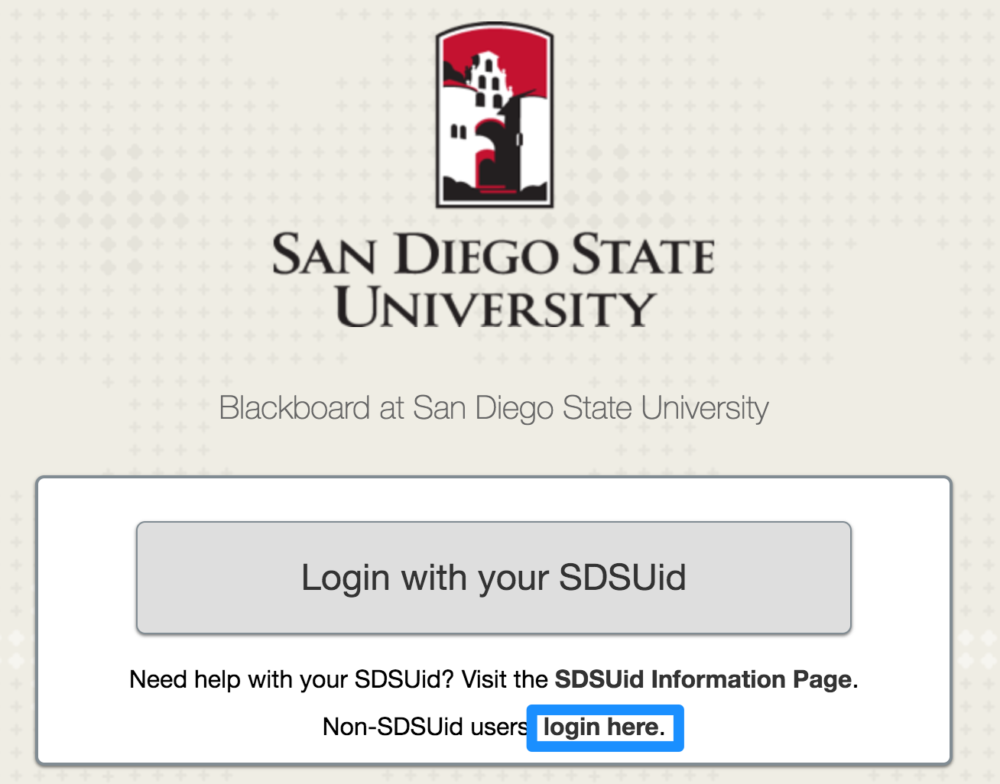

# Blackboard Login

As of January 5th, most users will login to Blackboard via SDSUid. Some users with GUI accounts \(some staff members, ITS staff, clicker users, CES students, etc\) will still need to login with a username and password, which can be accomplished via the Non SDSUid method listed below.

## SSO Login Issues

There are a few common issues associated with login in via SDSUid \(SAML SSO\), with the associated solution listed below. There are also macros in [Desk](desk.com.md) for all of these common responses, sometimes with a bit more detail.

### Session Expired

There are situations in which the SSO session will expire, but the user will remain logged in to the Office Portal \(portal.office.com\), because they have elected to stay signed in. This presents an issue when the user attempts to login to Blackboard, as their session is expired, but they will not be prompted to login via the Office365 Portal, as they are still signed in there. To fix this problem, have the user complete the following:  
1. Visit [portal.office.com](https://portal.office.com)  
2. Click on your name in the upper right hand corner and select the "Sign out" option.  
\(It might take a moment to fully sign out\)  
3. Go back to blackboard.sdsu.edu and login using your SDSUid.

To prevent this from occurring in the future, you can advice the user to choose "no" when prompted if they would like to stay signed in after logging into the Office365 Portal. This will result in the user being prompted to login when they try and access a service which uses AAD \(Azure Active Directory, what drives the Office365 Portal\), and their session is expired.

**Macro Name:** BB - SSO Session Expired

### Clear Session

If their session is still valid, which is indicated by the absence of the Session Expired Verbiage on the Error Page presented by Blackboard, we can try clearing the user's browser session. This varies from browser to browser, and is listed for each common browser in the [Reference Section](../reference/clear-browser-session.md).

**Macro Name:** BB - Clear Session

## Non-SDSUid Method

The new SDSUid login is only for users who previously used their RedID to login to Blackboard. Underneath the "Login with your SDSUid" button, you should see a line reading "Non-SDSUid users, login here." Click on the link in this line. A "Non-SDSUid Login" box and "Password" box should appear at the bottom of the home page. Use these boxes to enter your GUI credentials.

**Macro Name:** BB - GUI Login

